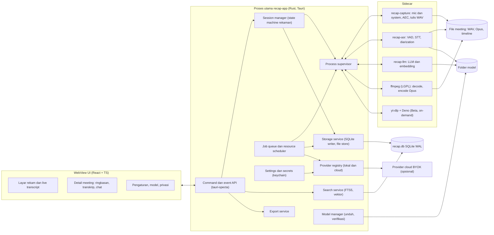
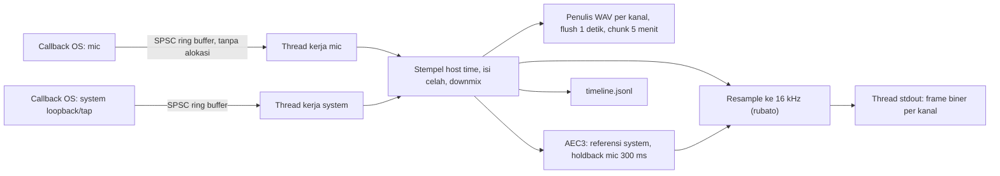
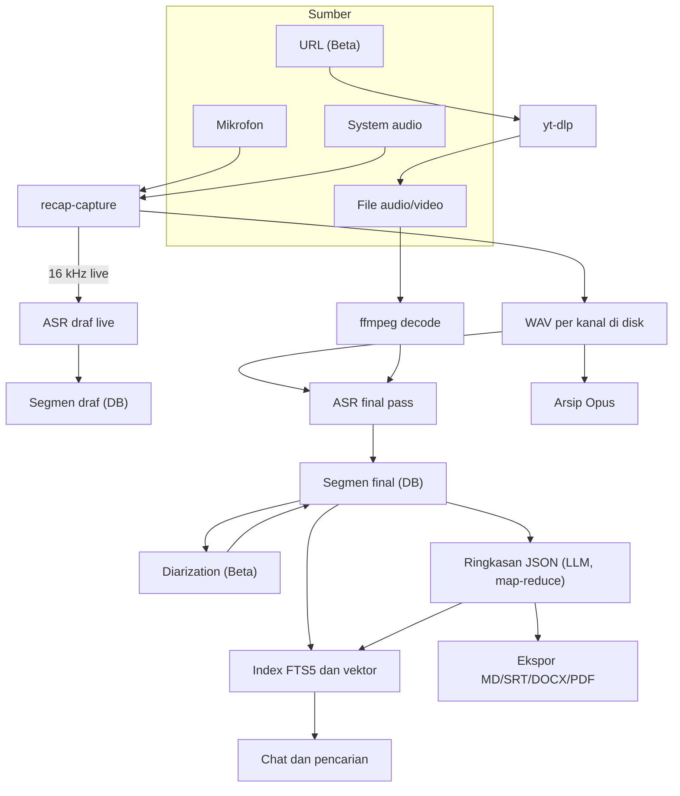
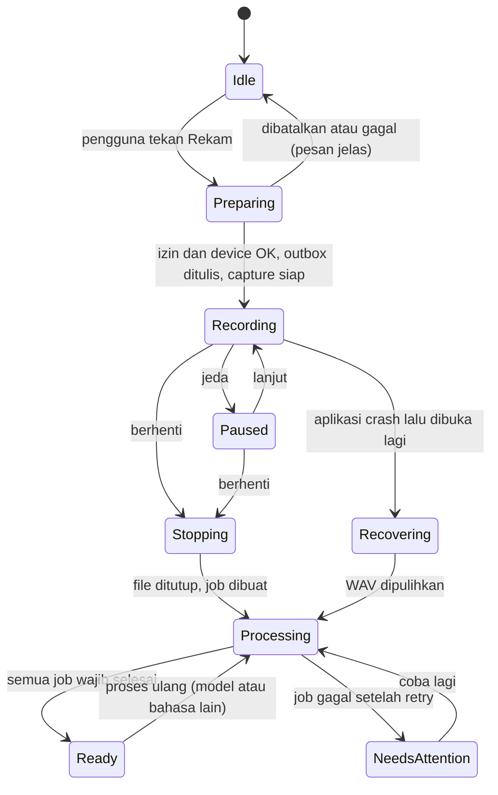
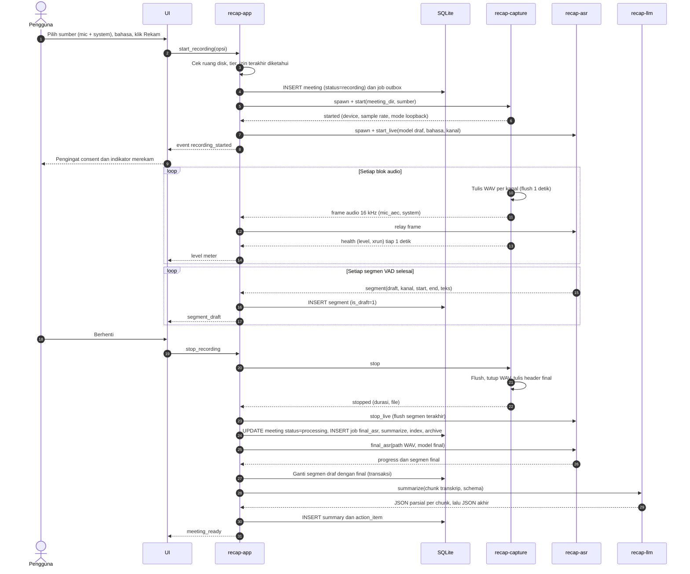
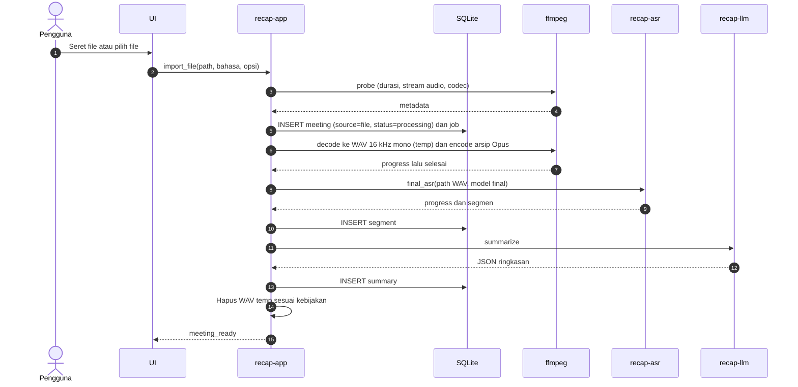
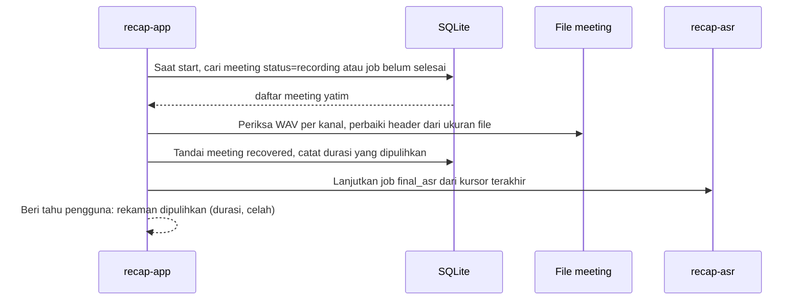
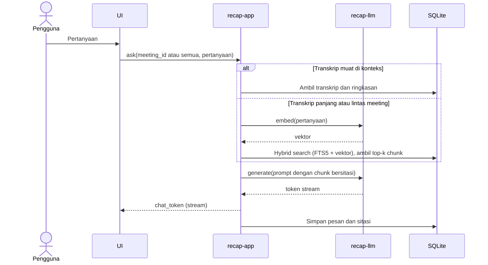

# 03. Arsitektur Sistem

Dokumen ini menjabarkan arsitektur Recap berdasarkan keputusan di dokumen 04, terutama ADR-003 (model proses dan IPC).

**Cakupan platform:** MVP khusus Windows (keputusan 2026-10-08). Bagian yang menyebut macOS adalah rancangan untuk port pasca-MVP, dipertahankan agar batas modul per OS sudah benar sejak awal.

## 1. Prinsip arsitektur

1. **Disk dulu, proses kemudian.** Audio mentah ditulis ke disk per kanal sebelum diproses apa pun. Semua pemrosesan lain (draf live, final pass, ringkasan) bisa diulang dari disk.
2. **Kanal terpisah dari ujung ke ujung.** Mic dan system tidak pernah dicampur, kecuali untuk playback dan ekspor.
3. **Isolasi kegagalan.** Komponen native berisiko (capture OS, ggml/ONNX) berjalan di sidecar. Crash satu sidecar tidak mematikan rekaman atau UI.
4. **Proses utama adalah satu-satunya pemilik data.** UI hanya menampilkan. Sidecar tidak menulis ke database.
5. **Job tahan crash.** Semua pekerjaan setelah rekaman adalah job di antrean SQLite yang bisa dilanjutkan setelah aplikasi dibuka ulang.
6. **Satu model berat di memori pada satu waktu** di tier hemat, diatur oleh scheduler sumber daya.
7. **Lokal secara default.** Komponen jaringan hanya aktif bila pengguna mengaktifkan provider cloud, import URL, atau unduhan model.

## 2. Gambaran komponen



### 2.1 Tanggung jawab komponen

| Komponen | Tanggung jawab | Tidak boleh |
|---|---|---|
| **UI (WebView)** | Tampilan, input pengguna, i18n, aksesibilitas | Menyimpan data primer; memanggil jaringan langsung (CSP ketat, `connect-src 'self'`) |
| **recap-app (proses utama)** | Satu-satunya penulis DB; orkestrasi sesi dan job; supervisi sidecar; relay audio live; panggilan HTTP ke provider cloud; keychain | Menjalankan inferensi ML atau kode capture OS |
| **recap-capture** | Membuka device; ring buffer lock-free; timestamp; isi celah; tulis WAV per kanal (flush 1 detik); resample 16 kHz; AEC; kirim frame 16 kHz ke proses utama | Menunggu konsumen mana pun (tidak pernah memblok karena konsumen lambat) |
| **recap-asr** | VAD per kanal; segmentasi; STT draf dan final; diarization (Beta); menghasilkan segmen | Menulis DB (hanya mengirim hasil) |
| **recap-llm** | Muat model GGUF; generate dengan grammar JSON; embedding | Akses jaringan |
| **ffmpeg** | Decode file import; encode arsip Opus; mix untuk ekspor | |
| **yt-dlp** (Beta) | Mengunduh audio dari URL | Memakai cookies browser |

### 2.2 Struktur monorepo (rencana)

```
recap/
  apps/desktop/
    src-tauri/            crate recap-app (proses utama)
    ui/                   React + Vite
  crates/
    recap-protocol/       frame IPC, tipe pesan, versi protokol
    recap-core/           tipe domain (Meeting, Segment, Job, ...)
    recap-store/          skema SQLite, migrasi, repository
    recap-audio/          WAV writer crash-safe, resampler, drift, gap fill
    recap-capture/        binary sidecar capture (modul per OS)
    recap-asr/            binary sidecar ASR (trait AsrEngine)
    recap-llm/            binary sidecar LLM (llama-cpp-2)
    recap-prompts/        prompt, JSON schema output, validator
  tools/
    eval/                 skrip benchmark WER/DER/ringkasan (boleh Python)
    corpus/               manifest korpus uji (audio tidak di-commit)
  docs/planning/
```

## 3. Pembagian proses dan threading

### 3.1 recap-capture



- **Callback OS hanya menyalin sample ke ring buffer** (crate `rtrb` atau `ringbuf`). Tidak ada mutex, alokasi, atau DSP di callback; ini pelajaran dari meetily.
- **Penulisan WAV** di thread terpisah dengan buffer memori. Bila disk lambat, data ditahan di memori dengan batas, misalnya 60 detik, lalu ditulis berurutan (pola Anarlog).
- **Pengisian celah:**
  - Celah loopback Windows (tidak ada paket saat hening) diisi sunyi berdasarkan selisih QPC.
  - Celah karena device berganti juga diisi sunyi dan dicatat di `timeline.jsonl`.
- **Pre-roll:** capture dimulai sebelum UI menampilkan "Merekam", dan 1 detik pertama disimpan (pelajaran amical #179).
- **Downmix semua kanal input** menjadi mono (pelajaran amical #165).
- **Kesehatan stream:** event `health` setiap 1 detik berisi level RMS per kanal, jumlah xrun, dan apakah system "sunyi total". Proses utama memakainya untuk peringatan izin/device.

### 3.2 recap-asr

- Thread penerima frame → VAD per kanal → antrean segmen **berbatas** → satu thread inferensi.
- Bila antrean draf tertinggal lebih dari 30 detik dari real time, worker beralih ke mode "lewati draf": segmen ditandai `pending_final` dan UI diberi tahu bahwa draf tertunda. Capture tidak pernah diperlambat.
- Final pass membaca WAV langsung dari disk berdasarkan path dari proses utama; tidak lewat relay.

### 3.3 recap-llm

- Satu model termuat. Job diproses berurutan. Token di-stream ke proses utama untuk chat.
- Model di-unload saat idle, lewat timeout yang bisa diatur, misalnya 5 menit.

## 4. Strategi IPC

### 4.1 UI ↔ proses utama

- **Command** (request/response) untuk aksi: `start_recording`, `stop_recording`, `import_file`, `get_meeting`, `search`, `ask`, dan seterusnya.
- **Event/Channel** untuk stream: `level`, `segment_draft`, `job_progress`, `chat_token`, `health_warning`.
- Tipe di-generate oleh `tauri-specta` dari struct Rust menjadi TypeScript. Contract test di CI memastikan daftar command sesuai.
- Capability Tauri dibatasi: WebView tidak punya akses shell atau filesystem langsung.

### 4.2 Proses utama ↔ sidecar (`recap-protocol`)

Format frame di stdin/stdout:

```
u32  panjang frame (little endian, tidak termasuk 4 byte ini)
u8   jenis: 0 = JSON control, 1 = audio
...  payload
```

- **Payload JSON control:** `{"v":1,"id":"...","type":"...","data":{...}}`. Jenis pesan antara lain `hello`, `probe`, `start`, `stop`, `health`, `segment`, `error`, `progress`, `done`.
- **Payload audio:** header 32 byte (versi, kanal `mic|mic_aec|system`, format `f32le|s16le`, kanal fisik, sample rate, seq, sample_start u64, host_time_ns u64, panjang), lalu PCM.
- **Handshake:** `hello` berisi versi protokol dan versi binary. Bila tidak cocok, sidecar ditolak dan kesalahan instalasi dilaporkan.
- **Probe:** `recap-capture probe` dan `recap-asr probe` mengembalikan JSON kemampuan (device, dukungan process loopback, GPU yang terdeteksi, varian yang termuat). Dipakai saat onboarding dan diagnosa.
- **Stderr:** JSON lines untuk log, ditulis proses utama ke `logs/` (berotasi, maksimal misalnya 50 MB total, tanpa isi transkrip).
- **Golden test** format frame di CI (pola fixture prismical).

### 4.3 Supervisi

- Restart dengan backoff 1, 2, 4, 8, lalu 10 detik, maksimal 5 kali per sesi.
- **Circuit breaker ASR:** 2 crash beruntun dalam satu rekaman menghentikan draf live. Final pass tetap dicoba nanti sebagai job.
- **Capture crash:** proses utama me-restart capture dalam segmen file baru. Celah waktu dicatat di timeline dan ditampilkan sebagai penanda di transkrip.

## 5. Alur data

### 5.1 Alur data tingkat tinggi



### 5.2 State machine sesi rekaman



## 6. Sequence diagram

### 6.1 Sesi live (meeting online, dua sumber)



### 6.2 Import file



Import URL (Beta) sama dengan import file, tetapi diawali langkah `yt-dlp` yang mengunduh `bestaudio` ke folder temp. Langkah ini punya progres sendiri dan error yang bisa dipahami pengguna, misalnya "Sumber berubah, perbarui komponen pengunduh".

### 6.3 Pemulihan setelah crash



### 6.4 Chat dengan transkrip (Beta)



## 7. Scheduler sumber daya

Aturan untuk tier hemat (8 GB):

| Situasi | Model termuat | Aturan |
|---|---|---|
| Merekam, draf live aktif | Model draf ASR kecil (sekitar 0,5 sampai 1 GB) | Tidak ada LLM. Embedding ditunda |
| Merekam, draf live dimatikan | Tidak ada | Hanya capture (CPU di bawah 5%) |
| Setelah rekaman | Model final ASR | Model draf di-unload dulu (proses `recap-asr` di-restart dengan model final) |
| Ringkasan | Model LLM | ASR di-unload (proses ASR dihentikan) |
| Indexing | Model embedding | Setelah ringkasan selesai, prioritas rendah |
| Rekaman baru saat job berjalan | Model draf | Job final/LLM dijeda (checkpoint), dilanjutkan setelah rekaman selesai |

Tier standar/kuat boleh menjalankan ASR dan LLM bersamaan bila RAM bebas melebihi ambang (misalnya model + 2 GB).

Scheduler membaca memori bebas (crate `sysinfo`) sebelum memuat model. Bila tidak cukup, ia menurunkan pilihan model sesuai tier dan memberi tahu pengguna.

## 8. Keamanan arsitektur (ringkas)

Detail ada di dokumen 06.

- **CSP WebView ketat.** Semua HTTP keluar lewat Rust, dengan allowlist host provider yang diaktifkan pengguna.
- **Sidecar dijalankan dengan path absolut** dari folder aplikasi, tanpa input shell.
- **Validasi input ffmpeg/yt-dlp:** argumen dibangun sebagai array dan URL divalidasi skemanya (`https`).
- **Unduhan model dan komponen** diverifikasi dengan SHA-256 dari katalog bertanda tangan.
- **Transkrip dianggap data tidak tepercaya di prompt LLM.** Guard terhadap prompt injection diterapkan, dan output divalidasi skema.

## 9. Keputusan terbuka yang dijawab spike

| Pertanyaan | Spike |
|---|---|
| Capture macOS: cidre atau helper Swift? Atribusi TCC untuk proses anak? | S2 (ditunda, pasca-MVP) |
| Apakah AEC3 cukup untuk target duplikasi? | S3 |
| Engine dan model final per tier? | S4 |
| Latensi draf live yang realistis per tier? | S5 |
| Model LLM default dan pass bahasa (langsung Indonesia atau Inggris lalu terjemah)? | S6 |
| Overhead relay audio di proses utama untuk 3 jam? | S10 |
