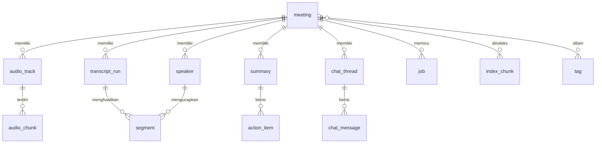

# 06. Data dan Privasi

Dokumen ini mencakup skema database, struktur file, enkripsi, retensi, consent perekaman (hukum dan etika), dan threat model singkat.

**Bagian hukum bukan nasihat hukum.** Sebelum rilis publik sebaiknya ditinjau oleh praktisi hukum di Indonesia.

## 1. Prinsip

1. **Data milik pengguna dan tinggal di perangkat.** Tidak ada server Recap, akun, atau telemetri konten.
2. **Minimisasi:** simpan yang dibutuhkan untuk fungsi yang dipilih pengguna; berikan kontrol retensi yang jelas.
3. **Transparansi saat data keluar perangkat:** setiap pengiriman ke provider cloud atau unduhan URL terlihat dan disetujui.
4. **Tidak ada pelatihan model** dengan data pengguna.
5. **Tidak ada voiceprint persisten** secara default.

## 2. Skema database (`recap.db`, SQLite WAL)

**Konvensi:**
- **ID:** ULID dalam bentuk teks; bisa diurutkan menurut waktu.
- **Waktu:** `INTEGER` milidetik epoch UTC. Ini berbeda dari meetily dan prismical yang memakai teks ISO; integer lebih mudah dihitung dan diurutkan.
- **Soft delete:** kolom `deleted_at`, lalu dihapus permanen oleh job pembersih sesuai retensi.
- **Migrasi:** maju saja, diberi nomor, berjalan dalam transaksi. Sebelum migrasi, `recap.db` dicadangkan.



### 2.1 Tabel inti

| Tabel | Kolom utama | Catatan |
|---|---|---|
| `meeting` | `id`, `title`, `title_source` (auto/user), `source_type` (live/file/url), `source_uri` (nama file atau URL, opsional), `capture_mode` (mic/system/dual), `language_mode`, `language_detected`, `started_at`, `ended_at`, `duration_ms`, `status` (recording/processing/ready/needs_attention/recovered), `folder` (path relatif), `template_id`, `consent_note`, `created_at`, `updated_at`, `deleted_at` | Satu baris per sesi atau import |
| `audio_track` | `id`, `meeting_id`, `channel` (mic/system/import), `device_name`, `device_id_hash`, `sample_rate`, `format` (wav16/opus), `path`, `duration_ms`, `sha256`, `state` (recording/finalized/archived/deleted) | `device_id_hash` dipakai untuk diagnosa tanpa menyimpan ID mentah |
| `audio_chunk` | `track_id`, `seq`, `path`, `start_sample`, `sample_count`, `host_time_start_ns`, `finalized` | Untuk recovery dan final pass per chunk |
| `transcript_run` | `id`, `meeting_id`, `kind` (draft/final), `engine`, `model_id`, `model_sha256`, `language_mode`, `params_json`, `status`, `started_at`, `finished_at`, `is_current` | Mendukung re-transkripsi dan perbandingan |
| `segment` | `id` (format `s` + nomor urut per meeting, stabil), `run_id`, `meeting_id`, `channel`, `speaker_id`, `start_ms`, `end_ms`, `text`, `lang`, `avg_logprob`, `no_speech_prob`, `words_json` (nullable), `flags` (dropped/duplicate/speaker_uncertain/edited), `edited_text` (nullable) | Teks asli tidak ditimpa saat diedit pengguna |
| `speaker` | `id`, `meeting_id`, `label` (Saya/Peserta/Pembicara 1), `display_name`, `channel`, `is_self`, `color` | Tidak menyimpan embedding |
| `summary` | `id`, `meeting_id`, `version`, `is_current`, `schema_id` (recap.summary.v1), `json`, `markdown`, `language`, `provider`, `model_id`, `prompt_version`, `params_json`, `created_at`, `edited_json` (nullable) | Versi lama tetap ada (pola backup meetily) |
| `action_item` | `id`, `meeting_id`, `summary_id`, `task`, `owner`, `due_text`, `due_date`, `priority`, `status` (open/done/dismissed), `evidence_json`, `updated_at` | Didenormalisasi untuk tampilan "Semua to-do" lintas meeting |
| `tag`, `meeting_tag` | | Organisasi |
| `chat_thread`, `chat_message` | `role`, `content`, `citations_json`, `provider`, `model_id` | Beta |
| `index_chunk` | `id`, `meeting_id`, `kind` (transcript/summary/action), `start_ms`, `end_ms`, `segment_ids`, `text` | Unit untuk FTS dan vektor |
| `index_vector` | `chunk_id`, `model_id`, `dim`, `vector` (BLOB) | Beta. Juga di virtual table `vec0` (sqlite-vec). BLOB disimpan agar bisa reindex |
| `job` | `id`, `meeting_id`, `type` (finalize_audio/final_asr/diarize/summarize/index/archive/export/url_download), `payload_json`, `state` (queued/running/done/failed/paused), `attempts`, `next_attempt_at`, `cursor_json`, `last_error`, `created_at`, `updated_at` | Antrean tahan crash (pola outbox prismical) |
| `model` | `id`, `kind` (asr/llm/embed/vad/diar), `variant`, `file`, `sha256`, `size_bytes`, `path`, `license`, `installed_at`, `last_used_at` | Katalog lokal |
| `provider_consent` | `provider_id`, `scope` (once/always), `data_kinds`, `granted_at`, `revoked_at` | Jejak persetujuan cloud |
| `setting` | `key`, `value_json` | **Tanpa rahasia** |
| `glossary_term` | `term`, `replacement` (nullable), `lang`, `usage_count` | Kosakata STT |

### 2.2 Index pencarian

```sql
-- FTS5 tanpa stemmer porter (porter hanya untuk Inggris)
CREATE VIRTUAL TABLE segment_fts USING fts5(
  text, content='segment', content_rowid='rowid',
  tokenize = 'unicode61 remove_diacritics 2'
);
CREATE VIRTUAL TABLE meeting_fts USING fts5(
  title, summary_text, action_text,
  tokenize = 'unicode61 remove_diacritics 2'
);
```

- FTS5 dijaga sinkron lewat trigger. Pencarian kata Indonesia berimbuhan, misalnya "dikirim" vs "kirim", tidak tertangani stemmer. Mitigasinya:
  - kueri prefix (`kirim*`)
  - ekspansi kueri sederhana
  - pencarian vektor di Beta
- Evaluasi trigram tokenizer sebagai opsi tambahan untuk pencocokan sebagian (**perlu diverifikasi** dampaknya ke ukuran DB).

### 2.3 Ketahanan database

- `PRAGMA journal_mode=WAL; synchronous=NORMAL; foreign_keys=ON;`
- **Satu thread penulis** di proses utama. Pembaca memakai koneksi terpisah.
- **Larangan keras:** jangan pernah menghapus `recap.db-wal` atau `-shm` (kesalahan meetily).
- **Bila DB gagal dibuka:**
  1. Salin seluruh trio file ke `backup/corrupt-<timestamp>/`.
  2. Coba `sqlite3 .recover` ke DB baru.
  3. Tampilkan dialog yang jujur kepada pengguna.
- **Cadangan otomatis:** `VACUUM INTO backup/recap-<tanggal>.db` mingguan, menyimpan 4 salinan terakhir. Bisa dimatikan.

## 3. Struktur penyimpanan file

Lokasi data default:

| OS | Lokasi |
|---|---|
| Windows | `%APPDATA%\Recap\` |
| macOS | `~/Library/Application Support/Recap/` |
| Linux | `~/.local/share/recap/` |

Pengguna bisa memindahkan **folder rekaman** ke lokasi lain (misalnya drive kedua).

```
Recap/
  recap.db, recap.db-wal, recap.db-shm
  meetings/
    2026/10/<meeting_id>/
      meta.json                  (salinan metadata, ditulis atomik: tulis tmp lalu rename)
      audio/
        mic/000001.wav ...       (16-bit 48 kHz mono, chunk 5 menit, saat rekam)
        system/000001.wav ...
        mic.opus                 (arsip setelah final pass)
        system.opus
      timeline.jsonl             (host time per blok, celah, pergantian device)
      import/                    (file asli bila pengguna memilih menyalin)
      exports/
  models/
    asr/ llm/ embed/ vad/ diar/  (file model + manifest .json berisi sha256)
  components/
    ffmpeg/ yt-dlp/ deno/        (komponen on-demand dengan versi)
  logs/                          (rotasi, maks 50 MB total, tanpa isi transkrip)
  backup/
  tmp/                           (dibersihkan saat start)
```

**Perkiraan ukuran:**

| Item | Ukuran |
|---|---|
| WAV saat rekam | sekitar 345 MB per jam per kanal |
| Arsip Opus 32 kbps | sekitar 14 MB per jam per kanal |
| Transkrip dan ringkasan | di bawah 2 MB per jam |
| Model | 0,5 sampai 9 GB, tergantung tier |

## 4. Enkripsi at-rest

| Opsi | Kelebihan | Kekurangan | Keputusan |
|---|---|---|---|
| A. Andalkan enkripsi disk OS (BitLocker, FileVault) | Tanpa kompleksitas, performa penuh | Tidak melindungi dari pengguna lain di akun yang sama atau malware | **MVP**: jelaskan di onboarding dan cek status FileVault/BitLocker bila memungkinkan (**perlu diverifikasi** API-nya) |
| B. "Vault" Recap: SQLCipher untuk DB + enkripsi file audio (AES-256-GCM, kunci di keychain OS, opsional passphrase) | Perlindungan tambahan untuk laptop bersama | Lebih lambat; kompatibilitas FTS5 dan sqlite-vec dengan SQLCipher **perlu diverifikasi**; risiko kehilangan data bila kunci hilang | **Pasca-1.0**, opt-in |
| C. Enkripsi per meeting yang ditandai "rahasia" | Granular | Kompleks | Dipertimbangkan bersama B |

Kebijakan lain:
- **Rahasia (API key):** selalu di keychain OS (ADR-022), tidak pernah di DB, log, crash dump, atau ekspor.
- **Izin file:** folder data dibuat dengan izin hanya-pengguna (mode 0700 di Unix, ACL default profil pengguna di Windows).

## 5. Kebijakan retensi

Pengaturan "Penyimpanan" dengan default yang aman dan mudah dipahami:

| Item | Default | Pilihan |
|---|---|---|
| WAV mentah | Dihapus setelah final pass sukses **dan** arsip Opus terverifikasi (cek durasi dan hash) | Simpan WAV (untuk kualitas maksimum); hapus langsung |
| Arsip audio Opus | Disimpan | Hapus setelah N hari (30/90/365); jangan simpan audio sama sekali (hanya transkrip) |
| Transkrip, ringkasan | Disimpan sampai dihapus pengguna | Hapus otomatis setelah N hari |
| Segmen draf | Dihapus 7 hari setelah final | |
| Sampah (soft delete) | 30 hari, lalu dihapus permanen | Kosongkan sekarang (dengan konfirmasi) |
| Log | 14 hari, maksimal 50 MB | Mode debug opt-in dengan batas ukuran (pelajaran prismical #19) |
| File temp import/URL | Dihapus setelah job selesai | |

- **Hapus meeting** menghapus baris DB (kaskade), folder meeting, entri FTS, dan vektor.
- **Hapus permanen** memakai penghapusan file biasa. Penghapusan aman (overwrite) tidak dijanjikan pada SSD; ini dijelaskan apa adanya di UI.
- **Ekspor seluruh data** (zip) disediakan agar pengguna tidak terkunci.

## 6. Consent perekaman: hukum dan etika

### 6.1 Kerangka hukum ringkas (dicek 2026-10-08, bukan nasihat hukum)

**Indonesia:**
- **UU ITE Pasal 31** (UU 11/2008 jo. UU 19/2016) melarang intersepsi tanpa hak atas informasi atau transmisi elektronik milik orang lain. Sanksinya ada di Pasal 47.
  - Menurut analisis Hukumonline, perekaman oleh **peserta percakapan** di perangkatnya sendiri umumnya **bukan** intersepsi.
  - Namun ada risiko gugatan perdata (perbuatan melawan hukum) dan pelanggaran privasi.
  - Tafsir atas audio meeting online belum diuji di pengadilan, sehingga statusnya abu-abu.
- **UU PDP No. 27/2022:**
  - Pasal 2 ayat (2) mengecualikan pemrosesan oleh perseorangan dalam **kegiatan pribadi atau rumah tangga**.
  - Untuk pemakaian kerja, organisasi pengguna menjadi pengendali data dan butuh dasar pemrosesan serta transparansi kepada peserta.
  - Pasal 4 memasukkan **data biometrik** sebagai data pribadi spesifik. Voiceprint untuk identifikasi unik berpotensi termasuk di dalamnya.
- **KUHP baru** (UU 1/2023, berlaku 2 Januari 2026): ketentuan terkait penyadapan **perlu diverifikasi**.
- **Posisi developer:** karena Recap local-first dan developer tidak menerima data, developer kemungkinan **bukan** pengendali atau prosesor data. Posisi ini berubah bila suatu saat ada sinkronisasi cloud, telemetri berisi konten, atau proxy server.

**Global:**
- **AS:**
  - Aturan federal: one-party consent.
  - Sekitar 11 negara bagian mensyaratkan persetujuan semua pihak, termasuk California, Florida, Illinois, Pennsylvania, dan Washington.
  - Ada gugatan kelompok *In re Otter.AI Privacy Litigation* (2025) atas perekaman peserta tanpa persetujuan dan voiceprint (BIPA).
- **EU (GDPR):**
  - Rekaman suara adalah data pribadi.
  - Ada pengecualian kegiatan rumah tangga.
  - Suara menjadi data biometrik (Pasal 9) hanya bila dipakai untuk identifikasi unik.
  - Hukum pidana nasional tertentu bisa lebih ketat.

### 6.2 Implikasi desain produk

Recap merekam tanpa bot, sehingga **tidak terlihat** oleh peserta lain. Tanggung jawab etis ada pada pengguna, dan produk harus membantu pengguna berbuat benar:

1. **Pengingat consent sebelum merekam** (default aktif, bisa diringkas setelah 3 kali). Contoh teks: "Pastikan semua peserta tahu sesi ini direkam dan ditranskripsi. Di beberapa negara dan situasi, persetujuan semua pihak diwajibkan."
2. **Template pesan siap tempel** (ID dan EN) untuk chat meeting, misalnya: "Halo semua, saya merekam dan mentranskripsi sesi ini secara lokal di perangkat saya dengan Recap untuk catatan rapat. Kabari saya bila keberatan." Tombol "Salin pesan".
3. **Catatan consent opsional** per meeting (`consent_note`), misalnya "Diumumkan di awal", tanpa memaksa.
4. **Indikator merekam yang jelas** di aplikasi dan tray, ditambah notifikasi sistem saat mulai.
5. **Deteksi meeting** (pasca-MVP) hanya memunculkan **saran**, dan **tidak pernah merekam otomatis** (pola prismical).
6. **Tidak menyimpan voiceprint** secara default. Fitur "kenali suara saya" (pasca-1.0) bersifat opt-in, lokal, bisa dihapus, dan ditandai sebagai data biometrik.
7. **Disclaimer import URL** (Beta), disetujui sekali, dengan inti: "Gunakan hanya untuk konten yang Anda berhak unduh dan proses. Mengunduh dari sebagian platform dapat melanggar ketentuan layanannya. Anda bertanggung jawab atas penggunaan ini."
8. **Halaman privasi di aplikasi** yang menjelaskan apa yang disimpan, di mana, dan kapan data keluar perangkat.
9. **Kebijakan penggunaan** di README/situs: Recap tidak untuk merekam percakapan yang pengguna tidak ikuti, atau merekam secara diam-diam yang melanggar hukum setempat.

## 7. Threat model singkat

Pendekatan: STRIDE ringkas untuk aset utama.

| Aset | Contoh ancaman | Dampak | Mitigasi |
|---|---|---|---|
| Audio dan transkrip di disk | Laptop hilang; pengguna lain di komputer yang sama; malware | Kebocoran isi rapat | Folder hanya-pengguna; anjurkan enkripsi disk; Vault opt-in (pasca-1.0); retensi otomatis |
| API key cloud | Terbaca dari DB, log, atau crash dump | Penyalahgunaan kuota/biaya | Keychain OS; redaksi di log; key tidak pernah dikirim ke WebView |
| Konten transkrip ke LLM | **Prompt injection** dari ucapan atau file import ("abaikan instruksi sebelumnya") | Ringkasan dimanipulasi; pada chat bisa memicu aksi | Transkrip diperlakukan sebagai data di tag terpisah; LLM **tidak punya tool berefek samping**; output divalidasi skema; bukti segmen diverifikasi |
| File import dan URL | File media berbahaya mengeksploitasi decoder; URL ke skema berbahaya | Eksekusi kode | ffmpeg di proses terpisah dengan argumen array; versi ffmpeg selalu terbaru; hanya `https://` untuk URL; yt-dlp tanpa cookies; ukuran maksimal |
| Rantai pasok | Model, ffmpeg, atau yt-dlp palsu; update aplikasi disusupi | Eksekusi kode | SHA-256 di katalog bertanda tangan; updater minisign; build CI reproducible sejauh mungkin; dependensi diaudit (`cargo deny`, `cargo audit`, `npm audit`) |
| WebView | XSS dari teks transkrip yang dirender | Akses ke command Tauri | Render teks tanpa `innerHTML`; CSP ketat; capability Tauri minimal; Markdown disanitasi |
| Sidecar | Binary sidecar diganti di folder aplikasi | Eksekusi kode | Signing semua binary; macOS hardened runtime; verifikasi versi lewat handshake |
| Provider cloud | Data dipakai atau disimpan provider | Privasi | Mati default; persetujuan eksplisit; data minimal (teks saja untuk ringkasan); tautan kebijakan provider |
| Integritas rekaman | Crash, disk penuh, mati listrik | Kehilangan audio | WAV flush 1 detik; recovery header; cek ruang disk; buffer saat disk lambat; job tahan crash |
| Privasi pihak ketiga | Peserta tidak tahu direkam | Hukum dan etika | Pengingat consent, template pesan, tidak ada voiceprint default |

**Di luar cakupan:** penyerang dengan akses admin/root penuh ke perangkat yang sedang terbuka kuncinya, dan forensik pada SSD setelah penghapusan.
