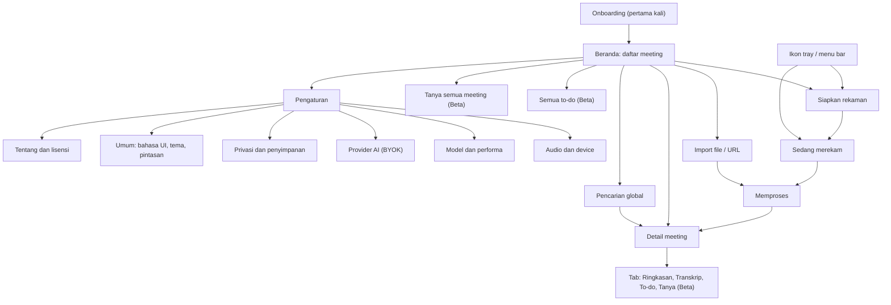
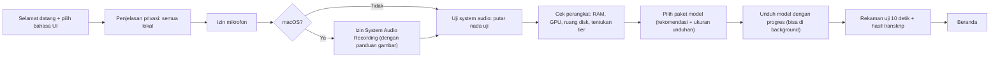

# 07. UX dan Alur Layar

## 1. Prinsip UX

1. **Satu klik untuk merekam, nol kejutan saat selesai.** Masalah (izin, device sunyi, disk) dideteksi **sebelum** atau **selama** rekaman, bukan sesudahnya.
2. **Selalu jelas apa yang terjadi pada data.** Ada indikator lokal atau cloud, dan perkiraan waktu proses.
3. **Bukti di setiap klaim AI.** Setiap poin ringkasan bisa diklik ke transkrip dan audio.
4. **Bahasa Indonesia sebagai warga kelas satu.** Copy UI ditulis dalam Bahasa Indonesia yang natural, bukan terjemahan kaku.
5. **Degradasi yang halus.** Di mesin lemah, fitur berat dimatikan dengan penjelasan, bukan gagal diam-diam.

## 2. Peta layar



## 3. Alur pengguna utama

### 3.1 Onboarding pertama kali



- **Cabang macOS** di diagram berlaku saat port pasca-MVP. MVP hanya Windows.
- **Langkah F (uji system audio)** memutar nada pendek dan memeriksa apakah loopback/tap menangkapnya. Bila sunyi, tampilkan panduan per OS. Di macOS, tunjukkan cara membuka System Settings, Privacy & Security, Screen & System Audio Recording.
- **Langkah H** menampilkan tier yang terdeteksi, misalnya: "Laptop Anda: 8 GB RAM, tanpa GPU, mode Hemat. Transkrip final 1 jam rapat sekitar 20 sampai 30 menit." Estimasi ini berasal dari benchmark mikro saat onboarding.
- **Pengguna bisa melewati unduhan** dan memakai aplikasi untuk merekam saja. Pemrosesan akan menunggu model.

### 3.2 Merekam meeting online

1. Klik **Rekam** (atau pintasan global, Beta).
2. Panel **Siapkan rekaman**:
   - pilih sumber: mic + system (default)
   - pilih device mic
   - pilih bahasa: "Indonesia (campur Inggris)"
   - pilih template
   - tampilkan **pengingat consent** + tombol "Salin pesan pemberitahuan"
3. **Mulai**. Indikator merah di tray atau menu bar, notifikasi sistem "Recap sedang merekam".
4. Selama rekaman:
   - level meter dua sumber
   - transkrip draf (bisa dilipat)
   - tombol jeda
   - bookmark (Beta)
   - catatan cepat (Beta)
5. Peringatan kontekstual, misalnya:
   - "Suara peserta sunyi selama 60 detik. Periksa izin atau device output."
   - "Terdengar gema dari speaker. Gunakan headset untuk hasil terbaik."
   - "Headset Bluetooth beralih ke mode panggilan, kualitas audio turun."
   - "Ruang disk tinggal 2 GB."
6. **Berhenti**. Layar **Memproses** dengan tahapan dan estimasi waktu. Pengguna bisa menutup layar; ada notifikasi saat siap.
7. **Detail meeting** terbuka di tab Ringkasan.

### 3.3 Merekam rapat tatap muka

Alurnya sama dengan 3.2, dengan perbedaan:
- Sumber default **mic saja**.
- Saran posisi laptop dan mic.
- Di Beta, opsi "jumlah peserta (perkiraan)" untuk diarization.

### 3.4 Import file atau URL

1. Seret file ke Beranda, atau buka **Import**.
2. Isi metadata: judul (default nama file), tanggal meeting (default tanggal file), bahasa, template.
3. **URL (Beta):**
   - Aktifkan fitur sekali dengan menyetujui disclaimer hak cipta/ToS.
   - Komponen pengunduh diunduh bila belum ada.
   - Tempel URL; tampilkan judul dan durasi sebelum memproses.
4. Masuk antrean, lalu layar Memproses.

### 3.5 Meninjau dan membagikan hasil

1. Tab **Ringkasan**: judul, ringkasan, poin penting, keputusan, to-do (checkbox, owner, tenggat), pertanyaan terbuka, agenda berikutnya. Setiap item punya ikon bukti `[↗ 00:12:31]`.
2. Klik bukti: pindah ke tab **Transkrip** di segmen itu dan audio diputar dari 2 detik sebelumnya.
3. Edit inline: klik teks untuk mengubah. Item yang diedit diberi tanda "diedit".
4. **Ekspor**: menu pilihan format, lalu simpan file atau salin.

### 3.6 Bertanya (Beta)

- Panel **Tanya** di detail meeting, atau **Tanya semua meeting** di Beranda.
- Jawaban di-stream, dengan sitasi yang bisa diklik.
- Bila memakai provider cloud, ada label "dijawab oleh: Lokal (Qwen3.5-9B)" atau "Cloud (nama provider)".

## 4. Wireframe teks

### 4.1 Beranda

```
+----------------------------------------------------------------------------------+
| Recap                       [ Cari di semua meeting...           ]  [Pengaturan] |
+----------------------------------------------------------------------------------+
| [ ● Rekam ]  [ ⇪ Import ]                                    Mode: Hemat (lokal) |
|                                                                                  |
| Hari ini                                                                         |
|  ▸ Sprint review produk           10:00  1j 42m  Saya + Peserta   ✓ Siap  3 to-do|
|  ▸ Rapat koordinasi dinas         08:30  2j 51m  Mic               ⟳ Memproses 64%|
| Minggu ini                                                                       |
|  ▸ Wawancara narasumber A         Sel    48m     Import (m4a)      ✓ Siap         |
|  ▸ Kuliah Metodologi (URL)        Sen    1j 30m  URL               ! Perlu cek    |
|                                                                                  |
| [Semua to-do (Beta)]  [Tanya semua meeting (Beta)]                               |
+----------------------------------------------------------------------------------+
```

### 4.2 Siapkan rekaman

```
+------------------------------- Siapkan rekaman ----------------------------------+
| Sumber audio    (•) Mic + suara peserta   ( ) Mic saja   ( ) Suara peserta saja  |
| Mikrofon        [ Mikrofon internal (Realtek)                    v ]  ▁▃▅▂ level  |
| Suara peserta   Semua aplikasi kecuali Recap                         ▂▅▇▃ level  |
| Bahasa          [ Indonesia (campur Inggris)  v ]                                |
| Template        [ Rapat umum                   v ]                               |
| Draf live       [x] Tampilkan transkrip draf (mode Hemat: kualitas draf rendah)  |
|                                                                                  |
| ⓘ Beri tahu peserta bahwa sesi ini direkam.   [ Salin pesan pemberitahuan ]      |
|                                                                                  |
|                                   [ Batal ]   [ ● Mulai merekam ]                |
+----------------------------------------------------------------------------------+
```

### 4.3 Sedang merekam

```
+------------------------------------------------------------------------------+
| ● MEREKAM  00:42:17      Saya ▂▅▃▁   Peserta ▅▇▆▃     [❚❚ Jeda] [■ Berhenti] |
+------------------------------------------------------------------------------+
| ⚠ Terdengar gema dari speaker. Gunakan headset untuk hasil terbaik. [Tutup]  |
+------------------------------------------------------------------------------+
| Transkrip draf (bisa berubah setelah diproses)                     [Lipat]   |
| 00:41:02  Peserta  Jadi untuk timeline-nya kita mundurin ke tanggal 20.      |
| 00:41:09  Saya     Oke, QA butuh dua hari buat regression ya.                |
| 00:41:15  Peserta  …                                                         |
+------------------------------------------------------------------------------+
| Catatan cepat (Beta): [                                              ]       |
+------------------------------------------------------------------------------+
```

### 4.4 Memproses

```
+-------------------------------- Memproses ------------------------------------+
| Sprint review produk  (1j 42m)                                                |
|  ✓ Menyimpan audio                                                            |
|  ⟳ Transkrip final        ███████████░░░░░  68%   sisa ±9 menit               |
|  ○ Ringkasan (lokal, Qwen3.5-4B)                                              |
|  ○ Indeks pencarian                                                           |
|                                                                               |
| Anda bisa menutup jendela ini. Kami akan memberi tahu saat selesai.           |
| [ Gunakan cloud untuk mempercepat (opsional)… ]                               |
+-------------------------------------------------------------------------------+
```

### 4.5 Detail meeting: tab Ringkasan

```
+-------------------------------------------------------------------------------------+
| ← Sprint review produk           Sel, 7 Okt 2026 10:00 · 1j 42m · ID+EN    [Ekspor v]|
| [Ringkasan] [Transkrip] [To-do 3] [Tanya]                         ▶ 00:00 ━━━○━━ 1:42|
+-------------------------------------------------------------------------------------+
| Ringkasan                                                                  [Edit]   |
| Tim meninjau progres sprint 14. Launch fitur pembayaran diundur ke 20 Okt karena    |
| QA butuh regression test dua hari…                                                  |
|                                                                                     |
| Keputusan                                                                           |
|  • Launch fitur pembayaran diundur ke 20 Oktober.                      [↗ 00:12:31] |
|                                                                                     |
| To-do                                                                               |
|  [ ] Siapkan regression test pembayaran   Owner: Dewi   Tenggat: 16 Okt [↗ 00:13:05]|
|  [ ] Kabari tim marketing soal jadwal baru Owner: (belum jelas) ⓘ       [↗ 00:15:40]|
|                                                                                     |
| Pertanyaan terbuka                                                                  |
|  • Apakah vendor payment gateway siap di sandbox?                        [↗ 00:22:10]|
| Agenda berikutnya · Risiko · Chapter (Beta)                                         |
|                                                                                     |
| Dibuat lokal · Qwen3.5-4B · prompt v1.2 · [Buat ulang] [Versi sebelumnya]           |
+-------------------------------------------------------------------------------------+
```

### 4.6 Detail meeting: tab Transkrip

```
+-------------------------------------------------------------------------------------+
| [Cari di transkrip…]   Filter: [Semua pembicara v]   [Proses ulang…]   Run: Final v |
+-------------------------------------------------------------------------------------+
| 00:12:31  Saya     ▶  Oke jadi untuk launch kita mundurin ke tanggal 20 ya.        |
| 00:12:36  Peserta  ▶  Setuju, tapi QA butuh dua hari buat regression test.         |
| 00:12:44  Peserta  ▶  [tidak jelas] … (ditandai: kemungkinan halusinasi) [Pulihkan] |
+-------------------------------------------------------------------------------------+
```

## 5. State kosong, loading, dan error

| Layar/komponen | Kosong | Loading | Error / kondisi khusus |
|---|---|---|---|
| Beranda | Ilustrasi + "Belum ada meeting. Rekam rapat pertama Anda atau import file." + dua tombol | Skeleton daftar | DB gagal dibuka: dialog pemulihan (dokumen 06, bagian 2.3) |
| Siapkan rekaman | "Mikrofon tidak ditemukan" + tombol buka pengaturan suara OS | Memeriksa device | Izin mic ditolak: panduan per OS; system audio tidak tersedia (OS lama): opsi mic saja + penjelasan |
| Sedang merekam | Draf live mati: "Transkrip akan dibuat setelah rekaman selesai" | Draf tertinggal: "Draf tertunda, rekaman tetap aman" | System sunyi lama; device terlepas (otomatis pindah ke default + catat celah); disk hampir penuh; capture crash (restart otomatis + penanda celah) |
| Memproses | n/a | Tahapan + estimasi + persen | Model belum diunduh: tombol unduh; job gagal: "Perlu perhatian" + detail + Coba lagi / Gunakan model lebih kecil / Gunakan cloud |
| Ringkasan | Transkrip terlalu pendek (di bawah 1 menit): tampilkan transkrip saja + opsi tetap ringkas | Skeleton per bagian | LLM gagal memenuhi skema: tampilkan transkrip + "Ringkasan gagal dibuat" + Coba lagi |
| Transkrip | Tidak ada ucapan terdeteksi: "Tidak ada suara terdeteksi. Periksa sumber audio." + putar audio | Virtual list + skeleton | Audio diarsipkan atau dihapus: playback non-aktif dengan penjelasan |
| Pencarian | "Tidak ada hasil untuk ‘…’" + saran kata lain | Spinner kecil | Indeks sedang dibangun: "Hasil mungkin belum lengkap" |
| Tanya (Beta) | Contoh pertanyaan | Token streaming | Tidak ada bukti: "Tidak ditemukan di transkrip" |
| Import URL (Beta) | n/a | Mengunduh komponen / audio | Sumber berubah: "Perbarui komponen pengunduh"; konten dibatasi: penjelasan tanpa menyarankan cookies |
| Pemulihan | n/a | "Memulihkan rekaman…" | "Rekaman dipulihkan: 2j 13m tersimpan, 2 detik terakhir hilang" |

**Copywriting:** kalimat aktif, tanpa jargon ("model", "VAD") di pesan utama. Detail teknis tersedia di "Lihat detail".

## 6. Aksesibilitas

- **Keyboard:**
  - Semua aksi bisa diakses dengan keyboard; fokus terlihat jelas.
  - Pintasan: `Ctrl/Cmd+R` rekam, `Ctrl/Cmd+Shift+R` jeda, `Ctrl/Cmd+F` cari, `Space` play/pause di transkrip, `J`/`K` lompat segmen.
  - Pintasan global bisa diatur (Beta).
- **Screen reader:**
  - Komponen Radix/shadcn dengan ARIA yang benar.
  - Level meter diberi label teks ("Mikrofon: aktif", "Suara peserta: sunyi").
  - Transkrip live memakai `aria-live="polite"` dengan throttling.
  - Diuji dengan NVDA (Windows) dan VoiceOver (macOS).
- **Visual:**
  - Kontras WCAG 2.2 AA; tema terang, gelap, dan ikuti sistem.
  - Warna tidak pernah satu-satunya penanda status; selalu ada ikon atau teks (misalnya "● MEREKAM").
  - Ukuran teks transkrip bisa diatur (90% sampai 150%); mendukung zoom OS.
- **Gerak:** hormati `prefers-reduced-motion`.
- **Bahasa:** atribut `lang` per segmen bila diketahui, agar pembaca layar memakai pelafalan yang tepat.
- **Kognitif:** pemrosesan panjang selalu menampilkan estimasi dan bisa ditinggal; tidak ada batas waktu interaksi.
- **Audit:** checklist aksesibilitas di setiap rilis; axe-core di tes e2e UI.
