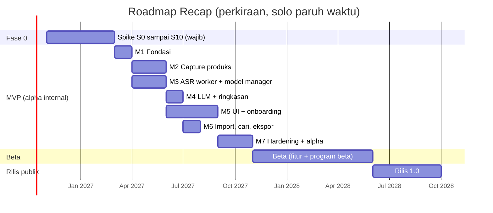
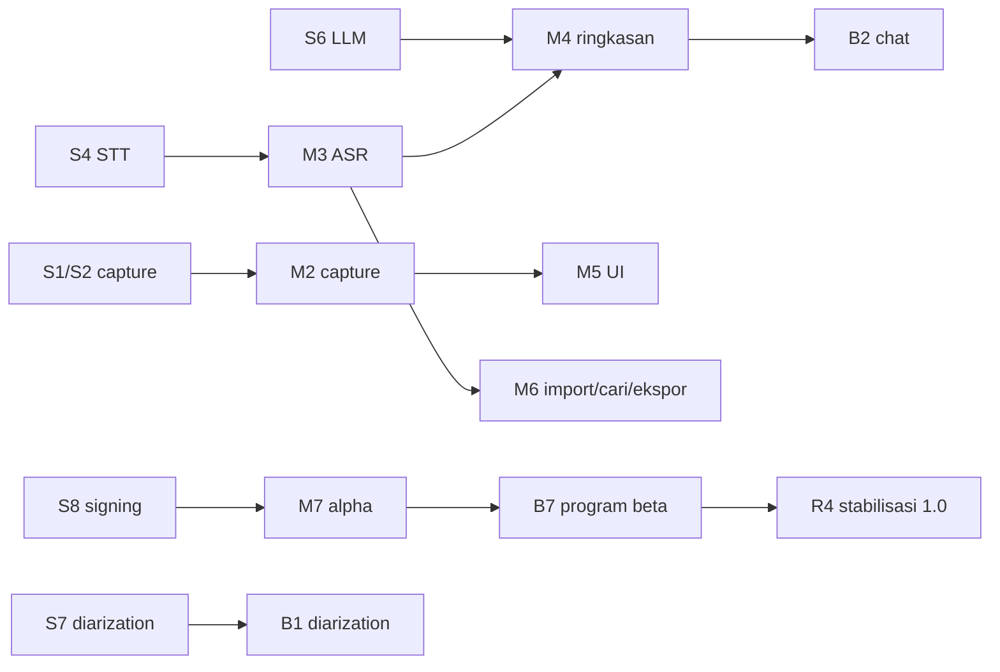

# 08. Roadmap

## 1. Asumsi estimasi

- **Tim:** satu developer paruh waktu, **10 sampai 20 jam efektif per minggu**, dibantu AI coding assistant (hasil klarifikasi 2026-10-08).
- **Ukuran usaha relatif:**

  | Ukuran | Jam kerja |
  |---|---|
  | S | 4 sampai 12 |
  | M | 12 sampai 30 |
  | L | 30 sampai 60 |
  | XL | 60 sampai 100 |

- **Rentang kalender** dihitung dari jam dibagi 10 sampai 20 jam per minggu, dengan buffer 20% untuk hal tak terduga (belajar Rust/audio, bug OS, review). Angka adalah **perkiraan kasar** untuk perencanaan, bukan komitmen.
- AI assistant mempercepat penulisan kode, tetapi tidak banyak mempercepat pengujian hardware lintas OS, alur izin, signing, dan evaluasi kualitas. Bagian-bagian ini justru dominan di proyek ini.

## 2. Gambaran fase

Gantt di atas memakai rentang **tengah** (sekitar 15 jam per minggu, termasuk buffer). Milestone yang tampak paralel (misalnya M2 dan M3) dikerjakan bergantian oleh satu orang; durasinya sudah memperhitungkan hal itu. Dengan 10 jam per minggu, kalikan sekitar 1,5. Dengan 20 jam per minggu, kalikan sekitar 0,75.

Kolom kalender sudah termasuk buffer 20%.

| Fase | Jam (perkiraan, tanpa buffer) | Kalender @10 j/mgg | Kalender @20 j/mgg | Hasil |
|---|---|---|---|---|
| Fase 0: spike | sekitar 190 (+ S7, S11 sekitar 24) | sekitar 6 bulan | sekitar 3 bulan | Keputusan teknologi terbukti; kerangka aplikasi bisa dirilis |
| MVP (alpha internal) | sekitar 470 | sekitar 13 bulan | sekitar 6,5 bulan | Aplikasi rekam + transkrip + ringkasan yang bisa dipakai sehari-hari oleh developer dan 3 sampai 5 penguji dekat |
| Beta | sekitar 385 | sekitar 10,5 bulan | sekitar 5,5 bulan | Fitur lengkap untuk persona; program beta terbuka |
| Rilis 1.0 | sekitar 220 | sekitar 6 bulan | sekitar 3 bulan | Rilis publik stabil, Linux, distribusi luas |
| **Total** | **sekitar 1.290 jam** | **sekitar 3 tahun** | **sekitar 1,5 tahun** | |

**Catatan kritis:** dengan kapasitas ini, rilis 1.0 baru tercapai sekitar 1,5 sampai 3 tahun lagi. MVP yang bisa dipakai sendiri tercapai sekitar 9 sampai 19 bulan dari sekarang (Fase 0 + MVP). Bila ingin lebih cepat, opsi paling efektif berurutan adalah:
1. **Rilis "MVP publik" lebih awal** (setelah M7, label beta) agar mendapat umpan balik nyata. Ini sudah tercermin di roadmap sebagai alpha lalu Beta.
2. **Pangkas Beta:** tunda chat lintas meeting dan semantic search ke setelah 1.0, karena FTS sudah ada. Hemat sekitar 70 jam.
3. **Tunda Linux** ke 1.x. Hemat sekitar 60 jam.
4. **Tambah kapasitas:** kontributor open source untuk UI/ekspor; atau satu platform dulu. Opsi terakhir ini sudah ditolak di klarifikasi, tetapi tetap jadi tuas terakhir bila jadwal meleset jauh.

## 3. Fase 0: spike teknis

Detail ada di dokumen 10.

**Milestone:**

| Milestone | Isi | Usaha | Kriteria selesai |
|---|---|---|---|
| F0.1 | S0 korpus + harness, pendaftaran Apple Developer + SignPath | M | Harness menghitung WER/CER/CS-WER/DER/RTF; akun Apple aktif; aplikasi SignPath diajukan |
| F0.2 | S1 capture Windows, S2 capture macOS | L + L | Lulus kriteria S1/S2 (dropout, sinkronisasi 50 ms atau kurang, recovery 2 detik atau kurang, izin macOS) |
| F0.3 | S4 benchmark STT, S5 latensi live | XL + M | Tabel model per tier terisi; konfigurasi default per tier memenuhi target, atau keputusan penyesuaian produk disetujui pemilik |
| F0.4 | S6 ringkasan LLM | L | Model default per tier memenuhi kriteria S6 |
| F0.5 | S8 kerangka + signing + updater, S9 ffmpeg | L + S | Installer bertanda tangan di mesin bersih; update otomatis berjalan |
| F0.6 | S3 AEC, S10 endurance | M + M | Hasil S3 menentukan AEC masuk MVP atau Beta; S10 lulus di mesin 8 GB |
| **Gerbang** | Review go/no-go bersama pemilik produk | S | ADR 001 sampai 014, 018, 020 berstatus Disetujui |

**Dependensi eksternal:** perangkat uji (laptop Windows 8 GB tanpa GPU, Windows dengan iGPU, Mac Apple Silicon), akun Apple Developer (USD 99), dan izin perekaman untuk korpus.

## 4. MVP (alpha internal)

**Tujuan:** lingkup MVP ramping dari dokumen 02, dipakai nyata oleh developer dan 3 sampai 5 penguji dekat.

| Milestone | Isi | Usaha | Dependensi | Kriteria selesai (terukur) |
|---|---|---|---|---|
| M1 Fondasi | Cargo workspace, `recap-protocol`, `recap-store` (skema + migrasi + FTS5), job queue tahan crash, process supervisor, logging berotasi, kerangka UI + i18n id/en, tauri-specta | L | F0 | Unit test inti 80% atau lebih coverage di `recap-store`/`recap-protocol`; job bertahan kill -9 dan lanjut; golden test protokol hijau |
| M2 Capture produksi | `recap-capture` Windows + macOS dari kode spike; health event; gap fill; drift metadata; pre-roll; device change; recovery saat start; AEC (bila S3 lulus) | XL | M1, S1, S2, S3 | Uji fault injection (kill di 5 titik) tanpa kehilangan lebih dari 2 detik; rekaman 3 jam lulus kriteria S10 di kedua OS |
| M3 ASR worker + model manager | `recap-asr` (whisper.cpp; transcribe.cpp bila S4 memilihnya), VAD Silero, segmenter live, final pass, filter halusinasi, re-transkripsi; model manager (katalog bertanda tangan, unduhan bisa dilanjutkan, SHA-256, tier detection) | XL | M1, S4, S5 | WER pada set regresi sama dengan hasil S4 (selisih 1 poin atau kurang); fallback GPU ke CPU teruji; unduhan model 1 GB tahan putus |
| M4 LLM + ringkasan | `recap-llm` (llama-cpp-2 + grammar), normalisasi transkrip, map-reduce hierarkis, validator skema + bukti + tanggal, versi prompt, regenerasi dengan backup | L | M3, S6 | Kriteria S6 tercapai di pipeline produksi pada 10 transkrip uji; transkrip 3 jam selesai tanpa melebihi konteks |
| M5 UI + onboarding | Beranda, siapkan rekaman (consent), sedang merekam (level, draf, peringatan), memproses, detail (ringkasan dengan bukti, transkrip virtual + player, to-do), pengaturan (audio, model, privasi, retensi), onboarding (izin, uji audio, tier, unduh model) | XL | M2, M3 | Semua alur di dokumen 07 bagian 3.1, 3.2, dan 3.5 berjalan; navigasi keyboard penuh; semua string id/en |
| M6 Import, cari, ekspor | Import file (ffmpeg LGPL); FTS5 lintas meeting; ekspor MD/TXT/SRT/VTT + clipboard; hapus dan sampah + retensi | M | M3, M4 | 13 format S9 lolos; pencarian 100 meeting dalam 200 ms atau kurang; ekspor SRT valid (diuji parser) |
| M7 Hardening + alpha | Matriks uji manual OS, perbaikan bug, dokumentasi pengguna singkat, rilis alpha bertanda tangan + auto-update, penguji dekat | L | M1 sampai M6 | Nol bug kritis terbuka; 20 sesi nyata oleh penguji tanpa kehilangan data; crash-free 98% atau lebih |

**Definition of Done MVP:**
- Rekam meeting online/tatap muka 2 sampai 3 jam di Windows dan macOS.
- Draf live (tier standar) dan final pass.
- Label Saya/Peserta.
- Ringkasan JSON (ringkasan, poin, keputusan, to-do, pertanyaan terbuka, agenda) dengan bukti yang bisa diklik.
- Import file, pencarian kata kunci, ekspor MD/SRT/VTT.
- UI id/en.
- Semua lokal, terpasang lewat installer bertanda tangan dengan auto-update.

## 5. Beta

| Milestone | Isi | Usaha | Dependensi | Kriteria selesai |
|---|---|---|---|---|
| B1 Diarization | sherpa-onnx offline, label Pembicara N, rename/merge/split, penyelarasan ke segmen | L | S7, M3 | Kriteria S7 di pipeline produksi; UI koreksi speaker teruji pengguna (3 dari 3 penguji berhasil) |
| B2 Chat + semantic search | Embedding (Qwen3-Embedding-0.6B / e5-small), sqlite-vec, hybrid RRF, chat per meeting dan lintas meeting dengan sitasi | XL | M4, M6 | 20 pertanyaan uji: jawaban benar dengan sitasi valid 80% atau lebih; "tidak ditemukan" benar untuk pertanyaan tanpa jawaban 90% atau lebih |
| B3 Cloud BYOK | Keychain, adapter OpenAI-compatible/Anthropic/Gemini (LLM) + Deepgram/OpenAI (STT), dialog persetujuan, log persetujuan | L | M4 | Uji kontrak per provider hijau; nol request jaringan tanpa persetujuan (diuji dengan proxy) |
| B4 Ekspor kaya + to-do lintas meeting | DOCX (docx-rs), PDF (Typst), ekspor audio; layar Semua to-do | M | M6 | Dokumen terbuka benar di Word/LibreOffice/Google Docs; PDF sesuai template |
| B5 Template + glosarium + editor | Template meeting, glosarium STT dan penggantian, editor Tiptap untuk ringkasan/catatan, bookmark dan catatan cepat saat rekam | L | M4, M5 | CS-WER turun pada korpus dengan glosarium (diukur); template menghasilkan skema valid |
| B6 Import URL (eksperimental) | yt-dlp + Deno on-demand, disclaimer, auto-update | M | S11, M6 | Kriteria S11 di produksi |
| B7 Program beta | Rilis kanal beta publik, form umpan balik, perbaikan, metrik dokumen 02 | L | B1 sampai B6 | 20 beta tester aktif; metrik target Beta (dokumen 02, bagian 8) tercapai atau ada rencana perbaikan |

Bila jadwal meleset, urutan pemangkasan Beta: B6, lalu B2 (sebagian, lintas meeting), lalu B5 (editor).

## 6. Rilis publik 1.0

| Milestone | Isi | Usaha | Kriteria selesai |
|---|---|---|---|
| R1 Linux | Capture PipeWire/Pulse, AppImage + deb, CI Linux | L | Lulus matriks uji Linux (dokumen 09) |
| R2 Distribusi luas | Microsoft Store/winget, Homebrew cask, situs + dokumentasi id/en | M | Paket terbit di minimal 2 kanal tambahan |
| R3 Kualitas dan aksesibilitas | Audit aksesibilitas (NVDA, VoiceOver), optimasi performa, evaluasi korpus penuh | M | WCAG AA checklist lulus; metrik 1.0 (dokumen 02) tercapai |
| R4 Stabilisasi | Bug bash, freeze fitur, kebijakan keamanan (SECURITY.md), proses rilis terdokumentasi | L | Nol bug kritis/tinggi terbuka; 4 minggu beta tanpa regresi kehilangan data |
| R5 Pasca-1.0 (opsional) | Deteksi meeting (saran), Vault terenkripsi, "kenali suara saya", macOS 13 via ScreenCaptureKit | n/a | Direncanakan ulang setelah 1.0 |

## 7. Dependensi kritis lintas fase

## 8. Ritme kerja yang disarankan

- **Siklus 2 minggu:** satu tujuan per siklus, demo pribadi (rekam video singkat), dan catatan kemajuan di `docs/progress/`.
- **Setiap akhir milestone:** jalankan evaluasi korpus + uji endurance singkat, lalu perbarui ADR bila ada perubahan.
- **Batas WIP:** maksimal satu spike atau milestone aktif plus satu perbaikan bug.
- **Review ulang roadmap** setiap 3 bulan terhadap jam yang benar-benar terpakai.
