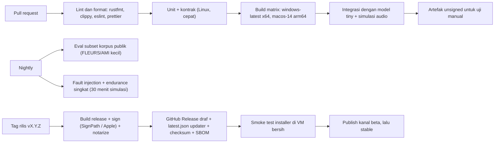

# 09. Risiko dan Strategi Pengujian

## 1. Daftar risiko

**Skala:**
- Probabilitas (P): Rendah, Sedang, Tinggi.
- Dampak (D): Rendah, Sedang, Tinggi, Kritis.

Setiap risiko utama punya spike di dokumen 10.

### 1.1 Risiko teknis

| ID | Risiko | P | D | Mitigasi | Spike |
|---|---|---|---|---|---|
| R-01 | **Kualitas STT Bahasa Indonesia dan code-switching** di bawah ekspektasi pada audio meeting nyata (bukan ucapan terbaca), terutama di tier hemat | Tinggi | Kritis | Korpus evaluasi sendiri sejak Fase 0; abstraksi engine (Whisper + Qwen3-ASR); mode bahasa per sesi; glosarium; re-transkripsi; opsi cloud BYOK | S4 |
| R-02 | **Kecepatan final pass di CPU tanpa GPU** terlalu lambat (Whisper turbo sekitar 0,8x real time di CPU 2020) | Tinggi | Tinggi | Qwen3-ASR-0.6B/1.7B (sekitar 2 sampai 4x real time di CPU); final pass berjalan di background dan bisa dilanjutkan; estimasi waktu jujur; opsi cloud | S4 |
| R-03 | **Izin audio macOS**: tidak ada API untuk cek izin tap; atribusi TCC untuk sidecar; perubahan perilaku di macOS 26; error mic `-10863` (prismical #21) | Sedang | Tinggi | Deteksi sunyi + panduan; uji dengan build Developer ID di macOS 14.2, 15, dan 26; helper Swift sebagai cadangan; uji mic AVAudioEngine dan HAL | S2 |
| R-04 | **Windows process loopback** tidak tersedia atau tidak stabil di sebagian Windows 10 | Sedang | Sedang | Fallback otomatis ke endpoint loopback (dengan suara Recap sendiri dibisukan); probe saat onboarding | S1 |
| R-05 | **Drift dan celah dua sumber audio** pada rekaman 2 sampai 3 jam (clock berbeda, loopback tanpa paket saat hening) | Tinggi | Sedang | Timestamp host per blok; isi celah; estimasi drift + resampler asinkron; file mentah tidak diubah | S1, S10 |
| R-06 | **Gema** (pengguna tanpa headset) membuat transkrip ganda dan atribusi salah | Tinggi | Sedang | WebRTC AEC3 di jalur STT; deteksi gema + anjuran headset; dedup teks sebagai cadangan | S3 |
| R-07 | **DRM / audio terproteksi / mode exclusive** tidak tertangkap loopback | Rendah (untuk meeting) | Sedang | Dokumentasikan; deteksi system sunyi saat aplikasi memutar audio; meeting app umum tidak terdampak | S1 |
| R-08 | **Bluetooth HFP**: kualitas mic dan loopback turun saat mic headset dipakai; endpoint berganti di tengah rekaman | Tinggi | Sedang | Peringatan di UI; jangan buka mic BT yang tidak dipilih; ikuti perubahan device dan catat celah; pre-wake BT (trik meetily) | S1, S2 |
| R-09 | **Penggunaan RAM model** di mesin 8 GB (ASR + LLM + aplikasi meeting yang juga berat) | Tinggi | Tinggi | Scheduler sumber daya: satu model berat dalam satu waktu; model Q4; konteks kerja 8k; draf live bisa dimatikan; cek memori bebas sebelum memuat | S6, S10 |
| R-10 | **Crash native** di ggml/ONNX (driver GPU, CPU lama, DLL clash) | Sedang | Tinggi | Sidecar terisolasi; build portabel (`GGML_NATIVE OFF`); varian CPU dan Vulkan dengan probe + fallback; ONNX Runtime dibundel dan di-pin | S4, S8 |
| R-11 | **Runtime baru belum matang** (transcribe.cpp, port GGUF Qwen3-ASR) | Sedang | Sedang | whisper.cpp sebagai default yang matang; transcribe.cpp di balik feature flag sampai lulus uji paritas WER | S4 |
| R-12 | **Kualitas ringkasan LLM kecil** dalam Bahasa Indonesia: halusinasi owner/tenggat, JSON tidak valid, ringkasan generik | Sedang | Tinggi | Grammar JSON; bukti segmen wajib + validasi; map-reduce; aturan fidelitas; evaluasi recall action item; opsi model 9B/12B dan cloud | S6 |
| R-13 | **Kehilangan data saat akhir rekaman** (kelas bug meetily #773 sampai #782) | Sedang | Kritis | Disk dulu; urutan stop yang teruji; job tahan crash; uji fault-injection (kill di setiap tahap) | S1, S10 |
| R-14 | **Korupsi database** | Rendah | Kritis | WAL tanpa penghapusan file; satu penulis; backup mingguan; `.recover` | uji integrasi |
| R-15 | **Perbedaan WebView** (WKWebView vs WebView2) dan startup hang (meetily #726, #700) | Sedang | Sedang | Uji e2e di kedua OS; stack UI standar; crash handler + log startup | S8 |
| R-16 | **Ukuran unduhan** (model 1 sampai 9 GB) menyulitkan onboarding di koneksi Indonesia | Tinggi | Sedang | Unduhan yang bisa dilanjutkan; paket model per tier; rekam tetap bisa tanpa model; mirror (Hugging Face + GitHub Releases) | S8 |
| R-17 | **sqlite-vec pra-1.0** berubah atau tidak terawat | Rendah | Rendah | Vektor juga disimpan sebagai BLOB; abstraksi index | n/a |

### 1.2 Risiko produk, legal, dan proyek

| ID | Risiko | P | D | Mitigasi |
|---|---|---|---|---|
| R-20 | **ToS platform sumber URL** (YouTube melarang unduhan) dan hukum hak cipta (UU 28/2014 Pasal 52 abu-abu) | Tinggi | Sedang | Fitur URL eksperimental, opt-in, disclaimer; tidak dibundel; tanpa cookies; prioritaskan file lokal; siap menghapus fitur bila ada keberatan |
| R-21 | **Kerapuhan yt-dlp** (sekitar 10 rilis dalam 8 bulan; butuh Deno dan PO token) | Tinggi | Rendah | Auto-update terpisah dari rilis aplikasi; pesan error yang jelas |
| R-22 | **Penyalahgunaan untuk merekam diam-diam**; pengguna melanggar hukum consent | Sedang | Tinggi (reputasi) | Pengingat consent, template pesan, kebijakan penggunaan, indikator merekam, tanpa voiceprint default |
| R-23 | **Code signing Windows** sulit untuk developer Indonesia (Azure tidak tersedia); SmartScreen menakuti pengguna | Tinggi | Sedang | SignPath Foundation (OSS); cadangan OV cloud HSM; Microsoft Store/winget; panduan instalasi |
| R-24 | **Enroll Apple Developer** bermasalah (laporan nama tunggal dari Indonesia) | Rendah | Tinggi | Daftar sedini mungkin di Fase 0; dokumen identitas konsisten; opsi entitas organisasi |
| R-25 | **Kapasitas developer solo paruh waktu**: lingkup terlalu besar, burnout, kurva belajar Rust/audio | Tinggi | Kritis | MVP ramping; spike dengan kriteria gagal yang jelas; potong fitur Beta bila jadwal mundur; reuse kode MIT; bantuan AI coding; batas waktu per spike (timebox) |
| R-26 | **Pergeseran ekosistem cepat** (model dan runtime baru tiap bulan) | Tinggi | Rendah | Abstraksi engine/provider; katalog model terpisah dari rilis aplikasi |
| R-27 | **Lisensi model berubah** atau model gated | Rendah | Sedang | Hanya model Apache-2.0/MIT sebagai default; manifest lisensi per model; tidak membundel model |
| R-28 | **Ekspektasi pengguna** ("seakurat Otter") tidak terpenuhi di mesin lemah | Sedang | Sedang | Komunikasi tier yang jujur; contoh hasil di onboarding; opsi cloud |
| R-29 | **Kontaminasi lisensi** saat menyalin kode (bagian turunan Screenpipe di meetily, Natively, noScribe) | Rendah | Tinggi | Hanya salin dari sumber MIT/BSD/Apache yang terverifikasi; catat asal di `THIRD_PARTY_NOTICES`; `cargo deny` untuk lisensi dependensi |

### 1.3 Tiga risiko terbesar

1. **R-01/R-02: kualitas dan kecepatan STT Indonesia di laptop tanpa GPU.** Ini menentukan apakah produk layak.
2. **R-25: kapasitas solo paruh waktu** dibanding lingkup lintas platform yang melibatkan audio native dan ML.
3. **R-13/R-05/R-03: keandalan capture dua sumber** selama 2 sampai 3 jam, termasuk izin macOS.

## 2. Strategi pengujian

### 2.1 Piramida pengujian

| Lapis | Cakupan | Alat |
|---|---|---|
| Unit (Rust) | Resampler, gap fill, estimator drift, WAV writer + recovery, segmenter VAD, dedup overlap, normalisasi transkrip, chunker token, merge/dedup action item, validator skema dan bukti, parser tanggal, migrasi DB | `cargo test`, `proptest` untuk properti (misalnya recovery WAV dari ukuran sembarang), `insta` (snapshot) |
| Unit (UI) | Komponen, i18n (semua key ada di id dan en), formatter waktu | Vitest + Testing Library |
| Kontrak | Frame `recap-protocol` (golden file); daftar command Tauri vs TS (tauri-specta); JSON schema vs fixture provider (OpenAI strict, Ollama, grammar llama.cpp) | Golden test di CI |
| Integrasi | Sidecar nyata dengan input file: `recap-capture --input-file` (mode simulasi), `recap-asr` dengan model tiny, `recap-llm` dengan model kecil; alur job end-to-end tanpa UI | `cargo test --features integration` |
| Uji audio (korpus) | WER/CER/CS-WER, DER, latensi, RTF pada korpus (dokumen 05, bagian 5) | `tools/eval` |
| Fault injection | Kill -9 pada setiap tahap (rekam, stop, final pass, ringkasan); disk penuh (filesystem kecil/kuota); device dicabut; sidecar crash berulang | Skrip harness + VM |
| Performa / endurance | Rekaman 3 jam dengan draf live; memori stabil (tanpa leak); CPU; ukuran file; drift | Harness + `sysinfo` logger |
| E2E UI | Alur onboarding (mock), rekam (sumber simulasi), import, ringkasan, ekspor, pencarian; axe-core | Playwright melalui `tauri-driver` / WebDriver (**perlu diverifikasi** dukungan macOS; alternatifnya E2E manual terskrip di macOS) |
| Manual lintas OS | Checklist rilis per OS: izin, capture nyata (Zoom, Meet, Teams), Bluetooth, multi-monitor, sleep/resume | Matriks di bawah |

### 2.2 Simulasi audio untuk tes otomatis

- `recap-capture` punya **mode sumber simulasi**: membaca dua file WAV (mic dan system) dengan clock yang bisa dibuat drift (misalnya +80 ppm), celah acak, dan jitter blok.
- Dengan begitu, logika gap fill, drift, dan recovery bisa diuji di CI tanpa hardware audio.
- **Sinyal uji:**
  - klik/tone berkala di kedua kanal untuk mengukur selisih sinkronisasi
  - ucapan korpus untuk STT
  - sinyal speaker-ke-mic (konvolusi respons ruangan) untuk AEC

### 2.3 Matriks uji lintas OS (manual, sebelum rilis)

| OS / perangkat | Fokus |
|---|---|
| Windows 10 22H2 x64, laptop 8 GB tanpa GPU (Intel gen 8 sampai 10 / Ryzen 3000 sampai 4000) | Tier hemat, process loopback, SmartScreen, NSIS |
| Windows 11 24H2, iGPU Intel Xe / AMD 680M (Vulkan) | Tier standar, varian Vulkan, fallback CPU |
| Windows 11 dengan GPU NVIDIA | Vulkan di dGPU, driver |
| macOS 14.2 / 14.x (M1, 8 GB) | Batas minimum, izin tap, tier hemat Apple |
| macOS 15 Sequoia (M2/M3 16 GB) | Tier standar Metal |
| macOS 26 (M4) | Izin terbaru, mic `-10863`, startup |
| Linux (pasca-MVP): Ubuntu 24.04 PipeWire, Fedora | Monitor PipeWire, AppImage |

**Skenario audio di setiap OS:**
1. Zoom
2. Google Meet (Chrome/Edge)
3. Teams (baru)
4. Headset kabel
5. Headset Bluetooth
6. Speaker laptop (gema)
7. Ganti device output di tengah rekaman
8. Sleep/resume saat merekam
9. Rekam 3 jam

### 2.4 Uji performa (target dari dokumen 02, bagian 7)

- **Benchmark final pass:** 1 jam audio korpus per tier. Catat RTF, puncak RAM, dan suhu/throttling bila memungkinkan.
- **Benchmark ringkasan:** transkrip 1 jam dan 3 jam. Catat waktu total, token/detik, dan puncak RAM.
- **Startup time** dan **ukuran installer** dicatat otomatis di CI. Regresi lebih dari 10% menggagalkan pipeline (soft gate).

## 3. CI/CD

### 3.1 Pipeline

**Detail penting:**
- **ggml portabel:** `GGML_NATIVE=OFF` dan dispatch varian CPU. Ada skrip verifikasi bahwa binary tidak memakai instruksi di atas baseline (pelajaran meetily).
- **Varian ASR/LLM:** CPU dan Vulkan untuk Windows; Metal untuk macOS. Smoke test `probe` di setiap runner.
- **Supply chain:**
  - `cargo deny` (lisensi + advisories), `cargo audit`, `npm audit`
  - Dependabot/Renovate
  - SBOM (CycloneDX)
  - Checksum SHA-256 untuk setiap artefak dan komponen yang diunduh (ffmpeg, model)
- **Rahasia CI:** sertifikat Apple dan kunci minisign hanya ada di job rilis yang dilindungi (environment protection).
- **Biaya runner:** runner macOS GitHub Actions gratis untuk repo publik (**perlu diverifikasi** kuota saat ini). Build lokal di Mac pribadi sebagai cadangan.

### 3.2 Packaging dan distribusi

| OS | Paket | Signing | Update |
|---|---|---|---|
| Windows | NSIS (per-user), nantinya MSIX/Store + winget | SignPath Foundation (OSS), cadangan OV cloud HSM | tauri-plugin-updater + `latest.json` |
| macOS | DMG arm64 | Developer ID + Hardened Runtime + notarization + staple | tauri-plugin-updater |
| Linux (pasca-MVP) | AppImage, deb, lalu Flatpak | n/a (checksum + signature GPG di release) | AppImage update / repositori |

**Kebijakan rilis:**
- Semantic versioning.
- Kanal `beta` dan `stable`; changelog berbahasa Indonesia dan Inggris.
- Rollback dengan menandai rilis lama sebagai `latest` di feed.
- **Komponen terpisah dari rilis aplikasi:** katalog model dan komponen (ffmpeg, yt-dlp, Deno) memakai manifest JSON yang ditandatangani, sehingga model/komponen bisa diperbarui tanpa merilis aplikasi.

## 4. Definition of Done umum (per fitur)

- Unit test dan kontrak hijau. Fitur yang menyentuh audio, STT, atau LLM punya uji integrasi.
- String UI tersedia dalam id dan en.
- Aksesibilitas: navigasi keyboard + label sudah dicek.
- Tidak ada data primer yang dipegang UI. Error punya pesan pengguna + detail teknis.
- Dokumentasi pengguna singkat diperbarui.
- Bila menambah dependensi: lisensi diperiksa dan dicatat di notice.
