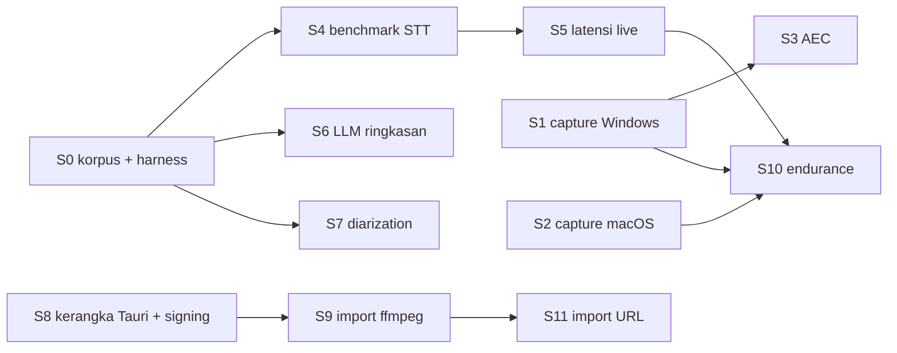

# 10. Rencana Spike (Fase 0)

Spike adalah eksperimen kecil ber-timebox untuk membuktikan asumsi berisiko sebelum membangun produk. Setiap spike menghasilkan:
1. kode prototipe di `tools/spikes/<id>` (boleh dibuang, tetapi sebisa mungkin menjadi cikal bakal crate produksi)
2. laporan singkat `docs/spikes/<id>.md` berisi data, keputusan, dan ADR yang terdampak
3. status **Lulus**, **Lulus bersyarat**, atau **Gagal**, beserta langkah lanjutannya

**Timebox** dihitung dalam jam kerja efektif, dengan asumsi solo paruh waktu 10 sampai 20 jam per minggu. Bila timebox habis tanpa kesimpulan, spike dihentikan dan ditandai "tidak meyakinkan". Langkah "jika gagal" lalu dijalankan; jangan memperpanjang tanpa batas.

## 1. Ringkasan dan urutan

| ID | Spike | Timebox | Bergantung pada | ADR yang diputuskan | Prioritas |
|---|---|---|---|---|---|
| S0 | Persiapan: korpus evaluasi + harness metrik | 16 jam | n/a | n/a | Wajib, paling awal |
| S1 | Capture Windows: process loopback + mic, dua track, 3 jam | 24 jam | n/a | 004, 007, 008 (sinkronisasi) | Wajib |
| S2 | Capture macOS: Core Audio tap + mic, izin, sidecar | 24 jam | Mac + Apple Developer | 005, 003 | Wajib |
| S3 | AEC WebRTC AEC3 dengan referensi system | 16 jam | S1 atau S2 | 008 | Wajib (hasil boleh "lulus bersyarat") |
| S4 | Benchmark STT Indonesia/Inggris/campur (akurasi + kecepatan) | 32 jam | S0 | 009, 010 | Wajib, paling kritis |
| S5 | Latensi draf live dan segmentasi VAD | 12 jam | S4 | 010, 011 | Wajib |
| S6 | Kualitas ringkasan LLM lokal (JSON, bukti, Bahasa Indonesia) | 24 jam | S0 (transkrip), S4 opsional | 013, 014 | Wajib |
| S7 | Diarization offline sherpa-onnx | 16 jam | S0 | 012 | Bisa ditunda ke awal Beta |
| S8 | Kerangka Tauri + sidecar + packaging + signing + updater | 24 jam | Akun Apple, pendaftaran SignPath | 001, 003, 020 | Wajib |
| S9 | Import file via ffmpeg LGPL (format beragam) | 6 jam | S8 | 018 | Wajib (kecil) |
| S10 | Endurance 3 jam di mesin 8 GB (rekam + draf + memori) | 12 jam | S1/S2, S5 | 003, scheduler | Wajib |
| S11 | Import URL yt-dlp + Deno on-demand | 8 jam | S9 | 017 | Sebelum Beta |

**Total wajib (S0 sampai S6, S8 sampai S10):** sekitar 190 jam, atau sekitar 10 sampai 19 minggu kalender pada 10 sampai 20 jam per minggu. S7 dan S11 menyusul.

**Urutan yang disarankan** (memaksimalkan informasi awal dan paralel secara logis):



**Gerbang go/no-go Fase 0 → MVP.** MVP dimulai bila S1, S2, S4, S6, dan S8 **lulus** (atau lulus bersyarat dengan mitigasi yang disepakati). Bila S4 gagal di tier hemat, lingkup produk disesuaikan (lihat bagian S4, "jika gagal") sebelum lanjut.

---

## S0. Korpus evaluasi dan harness metrik

- **Tujuan:** punya data dan alat ukur yang sama untuk semua spike berikutnya.
- **Langkah:**
  1. Kumpulkan 5 sampai 10 jam rekaman meeting Indonesia nyata **dengan izin tertulis semua peserta**:
     - minimal 2 jam meeting online dua kanal (mic dan system terpisah)
     - 2 jam tatap muka
     - 2 jam padat campur ID-EN
  2. Buat transkrip gold, minimal 3 jam: transkripsi manual, atau koreksi manual dari hasil model terbaik (dicatat sebagai bias). Anotasi speaker untuk 1 jam. Anotasi action item, keputusan, dan owner untuk 10 meeting/potongan.
  3. Tambahkan FLEURS id (subset test) dan AMI subset (CC-BY 4.0) sebagai pembanding.
  4. Harness `tools/eval`: WER/CER dengan normalisasi teks Indonesia (huruf kecil, angka ke kata atau sebaliknya secara konsisten, tanda baca dihapus), CS-WER (error pada token Inggris berdasarkan daftar kata atau tag manual), DER/JER, RTF, dan puncak RAM.
- **Lulus:** harness bisa menghitung semua metrik dari file hipotesis + gold, dan hasilnya cocok dengan perhitungan manual pada 3 sampel.
- **Gagal:** korpus nyata sulit didapat. Jalankan S4/S6 dengan FLEURS + AMI + rekaman simulasi (role-play meeting oleh 3 sampai 4 orang yang setuju), dan catat keterbatasannya.

## S1. Capture Windows

- **Tujuan:** membuktikan capture mic + system yang andal di Windows untuk 3 jam.
- **Langkah:**
  1. CLI Rust `recap-capture` (prototipe) memakai crate `wasapi` 0.25: process loopback mode EXCLUDE PID sendiri, mic shared mode, ring buffer, timestamp QPC, isi celah, dan WAV per kanal (chunk 5 menit, flush 1 detik).
  2. Fallback endpoint loopback bila aktivasi process loopback gagal.
  3. Uji di Windows 10 22H2 dan Windows 11 dengan Zoom/Meet/Teams, headset kabel, Bluetooth, ganti device, sleep/resume.
  4. **Sinkronisasi:** putar klik berkala lewat speaker yang direkam mic dan loopback sekaligus; ukur offset di awal dan setelah 2 jam.
  5. **Fault:** `taskkill /F` di menit acak; pulihkan WAV.
- **Lulus** (semua):
  - Tidak ada dropout lebih dari 100 ms dalam rekaman 3 jam (di luar kejadian device).
  - Setelah koreksi, offset mic vs system 50 ms atau kurang pada menit ke-120.
  - Kill paksa kehilangan 2 detik atau kurang; WAV dapat dibaca setelah recovery.
  - Suara aplikasi Recap sendiri (bunyi notifikasi uji) tidak tertangkap di jalur process loopback.
  - CPU proses capture di bawah 3% pada laptop uji.
- **Gagal:** process loopback tidak tersedia di Windows 10 uji. Pakai endpoint loopback sebagai default di Windows 10 + bisukan suara Recap, dan dokumentasikan. Bila drift tak terkendali, rekam dengan clock tunggal (resample ke clock mic) dan uji ulang.

## S2. Capture macOS

- **Tujuan:** membuktikan tap Core Audio + mic di macOS 14.2+ dari **sidecar** bertanda tangan, termasuk alur izin.
- **Langkah:**
  1. Dua prototipe, masing-masing maksimal 8 jam:
     - (a) Rust + `cidre` (tap global mono, exclude PID app dan sidecar)
     - (b) helper Swift kecil dengan protokol frame yang sama
  2. Mic lewat cpal (CoreAudio) dan alternatif AVAudioEngine.
  3. Build Developer ID + Hardened Runtime + `NSAudioCaptureUsageDescription`, `NSMicrophoneUsageDescription`, entitlement `audio-input`. Dijalankan sebagai sidecar dari aplikasi Tauri minimal.
  4. Uji di macOS 14.x, 15, dan 26. Izin ditolak, lalu diberikan. Headset Bluetooth (pre-wake trick). Ganti output.
- **Lulus:**
  - Prompt izin muncul atas nama aplikasi Recap (bukan sidecar tak dikenal), dan setelah diizinkan, system audio tertangkap dari sidecar.
  - Kriteria dropout, sinkronisasi, dan recovery sama dengan S1.
  - Mic bekerja di macOS 26 (tidak ada `-10863`).
  - Izin ditolak terdeteksi sebagai "system sunyi" dalam 10 detik atau kurang, dengan pesan panduan.
- **Gagal:**
  - Atribusi TCC sidecar gagal → capture dipindah ke proses utama (in-process) khusus macOS.
  - cidre tidak stabil → pakai helper Swift.
  - Mic gagal di macOS 26 → ganti jalur mic ke AVAudioEngine.

## S3. Echo cancellation (AEC3)

- **Tujuan:** mengurangi gema speaker di jalur mic agar "Saya vs Peserta" benar saat tanpa headset.
- **Langkah:**
  1. Crate `webrtc-audio-processing` 2.1 (AEC3), referensi = system audio, holdback mic 300 ms, frame 10 ms.
  2. Rekam 30 menit di laptop dengan speaker: peserta remote berbicara, pengguna sesekali berbicara (termasuk double-talk).
  3. Transkripsi lane mic sebelum dan sesudah AEC.
- **Lulus:**
  - Proporsi kata "peserta" yang muncul di transkrip lane mic turun 80% atau lebih dibanding tanpa AEC.
  - WER ucapan pengguna di lane mic tidak naik lebih dari 3 poin absolut.
  - CPU tambahan di bawah 5%.
- **Lulus bersyarat:** reduksi 50 sampai 80% → AEC aktif + dedup teks sebagai lapisan kedua.
- **Gagal:** MVP memakai deteksi gema + anjuran headset + dedup teks. AEC dipindah ke Beta (atau dicoba speexdsp / AEC neural).

## S4. Benchmark STT (paling kritis)

- **Tujuan:** memilih engine dan model per tier berdasarkan data Indonesia nyata.
- **Matriks uji:**
  - **Engine/model:**
    - whisper.cpp v1.9.x: small, medium, large-v3-turbo (q5, q8), large-v3 (q5)
    - transcribe.cpp: Qwen3-ASR-0.6B dan 1.7B (GGUF)
    - pembanding opsional: Qwen3-ASR via sherpa-onnx; satu provider cloud (Deepgram Nova-3 `id`) **hanya pada data yang boleh dikirim**
  - **Mode bahasa:** `id` dikunci, deteksi terbatas `[id, en]`, auto.
  - **Perangkat:**
    - (A) laptop Windows 8 GB tanpa GPU, CPU sekitar 2019 sampai 2021
    - (B) Windows dengan iGPU (Vulkan)
    - (C) Mac M1/M2 8 sampai 16 GB
- **Metrik:** WER, CER, CS-WER, kata halusinasi per menit hening, RTF, puncak RAM, keberhasilan GPU/fallback.
- **Lulus:** ada konfigurasi per tier yang memenuhi:
  - **Hemat (A):** WER final ID-meeting 20% atau kurang, **dan** RTF final 0,5 atau kurang (3 jam selesai dalam 1,5 jam atau kurang), **dan** puncak RAM 3 GB atau kurang.
  - **Standar (B/C):** WER 15% atau kurang dan RTF 0,25 atau kurang.
  - CS-WER 25% atau kurang di setidaknya satu konfigurasi per tier.
  - transcribe.cpp hanya boleh dipakai bila WER-nya dalam 1 poin dari implementasi referensi (paritas), pada 30 menit sampel.
- **Gagal (tier hemat tidak memenuhi):**
  - Ubah janji produk: di tier hemat, final pass berjalan "semalaman / saat idle" dengan estimasi jujur, dan opsi cloud ditawarkan lebih menonjol.
  - Atau naikkan spesifikasi minimum ke 16 GB / iGPU modern.
  - **Keputusan ini dibawa ke pengguna (pemilik produk).**

## S5. Latensi draf live dan segmentasi

- **Tujuan:** memastikan draf live berguna tanpa membebani rekaman.
- **Langkah:**
  1. Pipeline VAD Silero v6 per kanal + segmenter (redemption 600 ms, maksimal 20 detik, overlap 1 detik) + model draf dari S4.
  2. Putar ulang 1 jam audio dua kanal secara real time.
  3. Ukur latensi dari akhir ucapan sampai teks muncul, backlog antrean, dan CPU.
- **Lulus:**
  - p95 latensi 10 detik atau kurang (hemat) / 5 detik atau kurang (standar).
  - Tidak ada backlog yang tumbuh terus selama 1 jam.
  - CPU total (capture + ASR) 40% atau kurang di tier hemat.
  - Halusinasi pada bagian hening mendekati nol.
- **Gagal:** di tier hemat draf live default **mati** (opsional "draf hemat" dengan model terkecil). Draf live hanya default di tier standar ke atas.

## S6. Ringkasan LLM lokal

- **Tujuan:** memilih model dan strategi prompt untuk ringkasan JSON Bahasa Indonesia.
- **Langkah:**
  1. 10 transkrip (5 dari korpus nyata, 5 AMI/simulasi), dengan durasi 20 menit, 1 jam, dan 2 sampai 3 jam.
  2. Model: Qwen3.5-4B, Qwen3.5-9B, Gemma 4 12B (Q4_K_M) via llama.cpp + grammar dari `recap.summary.v1`; pembanding cloud pada data publik/izin.
  3. Varian: (a) langsung Bahasa Indonesia; (b) Inggris lalu terjemah; (c) map-reduce vs satu pass (untuk yang muat).
  4. Penilaian: recall/presisi action item, keputusan, dan owner vs anotasi; validitas JSON; sitasi valid; rubrik 1 sampai 5 oleh 2 penilai; waktu dan RAM.
- **Lulus** (untuk model default per tier):
  - JSON valid 100%.
  - Recall action item 80% atau lebih.
  - **Nol** owner/tenggat karangan.
  - Sitasi valid 95% atau lebih.
  - Rubrik rata-rata 4 atau lebih (standar) / 3,5 atau lebih (hemat).
  - Waktu untuk transkrip 1 jam 10 menit atau kurang (standar) / 20 menit atau kurang (hemat).
- **Gagal:**
  - Tier hemat memakai ringkasan "ekstraktif" (daftar keputusan dan to-do dengan bukti, tanpa paragraf ringkasan) + saran cloud.
  - Atau pertimbangkan model lain dari leaderboard SEA-HELM terbaru.

## S7. Diarization offline (sherpa-onnx)

- **Tujuan:** memvalidasi diarization multi-speaker lokal untuk Beta.
- **Langkah:** sherpa-onnx (crate resmi 1.13.x) dengan segmentasi pyannote 3.0 + embedding 3D-Speaker CAM++ vs WeSpeaker ResNet34. Clustering dengan threshold vs jumlah speaker diketahui. Uji pada korpus beranotasi + AMI.
- **Lulus:**
  - DER 25% atau kurang (sampai 6 speaker, audio meeting online kanal system).
  - DER 30% atau kurang (tatap muka, satu mic laptop).
  - Waktu proses 1 jam audio 10 menit atau kurang di tier standar.
  - Puncak RAM 1,5 GB atau kurang.
- **Gagal:** diarization lokal ditawarkan sebagai "eksperimental" dengan kontrol koreksi yang kuat, dan opsi cloud (Deepgram/AssemblyAI) menjadi jalur kualitas.

## S8. Kerangka aplikasi, packaging, signing, updater

- **Tujuan:** menghilangkan risiko "tidak bisa dirilis" sejak awal.
- **Langkah:**
  1. Workspace Tauri 2 + React. Satu sidecar dummy Rust yang berbicara `recap-protocol` (handshake, frame audio palsu, crash simulasi, supervisi).
  2. CI build Windows x64 + macOS arm64.
  3. Signing: Apple Developer ID + notarization; Windows via SignPath (atau self-signed sementara bila pendaftaran belum disetujui).
  4. tauri-plugin-updater dari GitHub Releases (v0.0.1 → v0.0.2).
  5. Uji instalasi di VM/mesin bersih Windows 10, Windows 11, dan macOS 14/26.
- **Lulus:**
  - Installer berjalan di mesin bersih.
  - Sidecar ter-sign dan spawn tanpa peringatan Gatekeeper.
  - Update otomatis berhasil.
  - Ukuran installer di bawah 30 MB (tanpa ffmpeg dan model).
  - Startup 3 detik atau kurang.
  - Crash sidecar dipulihkan oleh supervisi.
- **Gagal:** catat blokir (misalnya enroll Apple tertunda) dan jalankan paralel dengan build unsigned untuk uji internal. Rilis publik tertunda sampai signing beres.

## S9. Import file via ffmpeg

- **Tujuan:** decode semua format umum dengan ffmpeg LGPL.
- **Langkah:** 15 file uji (mp3, m4a/AAC, wav 24-bit, flac, ogg, **opus WhatsApp**, mp4 H.264, mkv, webm, mov iPhone, wma, amr, video 3 jam, file rusak, file tanpa audio). Decode ke 16 kHz mono; encode arsip Opus.
- **Lulus:** 13 dari 13 file valid berhasil; 2 file tidak valid ditolak dengan pesan jelas; konfigurasi build ffmpeg terverifikasi LGPL (`ffmpeg -L` dan `-buildconf` tanpa `--enable-gpl`); progres dilaporkan.
- **Gagal:** cari sumber build LGPL lain, atau build sendiri di CI.

## S10. Endurance 3 jam di mesin 8 GB

- **Tujuan:** memastikan seluruh rantai rekaman tahan lama di mesin terlemah yang didukung.
- **Langkah:**
  1. Laptop 8 GB tanpa GPU, Zoom/Meet berjalan bersamaan.
  2. Rekam 3 jam dua kanal + draf live (bila S5 lulus untuk tier ini).
  3. Log memori, CPU, ukuran file, backlog, dan drift tiap menit.
  4. Lanjut final pass + ringkasan.
- **Lulus:**
  - Tidak ada crash.
  - RSS total Recap tidak tumbuh lebih dari 10% setelah menit ke-30 (tanpa leak).
  - Aplikasi meeting tidak tersendat (subjektif + CPU di bawah 60% total).
  - Audio lengkap; drift dalam batas S1.
  - Final + ringkasan selesai sesuai target S4/S6.
- **Gagal:** profiling. Matikan draf live di tier hemat. Kurangi buffer. Pertimbangkan menaikkan spesifikasi minimum.

## S11. Import URL (sebelum Beta)

- **Tujuan:** menilai kelayakan dan beban perawatan import URL.
- **Langkah:** unduh yt-dlp resmi + Deno on-demand (verifikasi checksum), `bestaudio` dari 20 URL publik (YouTube, Vimeo, podcast RSS/MP3, Google Drive publik), tanpa cookies; ukur keberhasilan dan waktu; simulasikan versi usang.
- **Lulus:** 18 dari 20 berhasil dengan versi terbaru. Versi usang terdeteksi dan diperbarui otomatis. Ukuran komponen on-demand dicatat.
- **Gagal:** fitur URL dibatasi ke sumber non-YouTube / tautan file langsung, atau ditunda.

---

## 2. Format laporan spike

```markdown
# Spike Sx: <nama>
Tanggal: YYYY-MM-DD · Jam terpakai: N / timebox M
Lingkungan: OS, CPU, RAM, GPU, versi library/model (dengan tanggal cek)
## Hipotesis
## Metode
## Hasil (tabel data mentah + ringkasan)
## Status: Lulus / Lulus bersyarat / Gagal / Tidak meyakinkan
## Keputusan dan ADR yang diperbarui
## Kode yang dipertahankan untuk produksi
## Risiko baru
```
